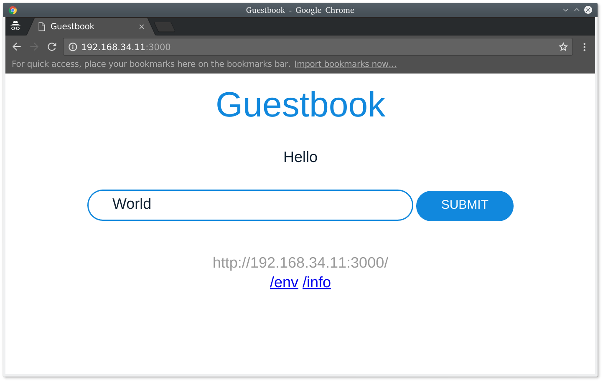

# Kubernetes Network Policy + Cilium

This tutorial will show you how you can have full IPv6 connectivity between
docker containers orchestrated by kubernetes. All your services will be able to
talk with their producers by only using the service name instead of static IPs.
The containers started by kubernetes will have some labels where the policy for those labels
will be pushed to the [v1beta1 kubernetes network policy API](https://github.com/kubernetes/kubernetes/blob/master/docs/proposals/network-policy.md)
and enforced with Cilium.

## Requirements

 - Virtualbox with 2 host only networks `192.168.33.1/24` and `192.168.34.1/24` and DHCP mode off
 - Cilium vagrant image with K8S mode ON
 - Tested with `kubernetes-v1.5.1`

### Set up cilium vagrant image with K8S mode ON

**Make sure you've 2 host only networks in your virtualbox configurations. Open Virtualbox: File > Preferences > Network > Host-only and check.**

Start the vagrant VM with our provided scripts:
```
K8S=1 ./contrib/vagrant/start.sh
```

*This might take a while depending on your network bandwith and machine speed.*

After the machine is set up you can SSH into it and check if everything is running properly:

```
K8S=1 vagrant ssh cilium-k8s-master
```
*Inside the VM check kubernetes component statuses:*
```
kubectl get cs
```
```
NAME                 STATUS    MESSAGE              ERROR
controller-manager   Healthy   ok
scheduler            Healthy   ok
etcd-0               Healthy   {"health": "true"}
```
Check kubernetes nodes:
```
kubectl get nodes
```
```
NAME            STATUS    AGE
cilium-master   Ready     9m
```
Check cilium daemon status:
```
cilium daemon status
```
```
KVStore:      OK - 172.17.0.2:8300
Docker:       OK
Kubernetes:   OK - v1.5.1
Cilium:       OK
V4 addresses reserved:
 10.1.0.1
V6 addresses reserved:
```

*Note: Cilium is running in "baremetal" and not in a kubernetes daemonset.*

### Check if you can ping your VM from the host
```
$ ping -c 1 192.168.34.11
PING 192.168.34.11 (192.168.34.11) 56(84) bytes of data.
64 bytes from 192.168.34.11: icmp_seq=1 ttl=64 time=0.195 ms

--- 192.168.34.11 ping statistics ---
1 packets transmitted, 1 received, 0% packet loss, time 0ms
rtt min/avg/max/mdev = 0.195/0.195/0.195/0.000 ms
```

## Create the kubernetes network policies

Go to the VM and run the following commands:

```
kubectl create -f https://raw.githubusercontent.com/cilium/cilium/changing-k8s-installation/examples/kubernetes/network-policy/dashboard-policy.json
kubectl create -f https://raw.githubusercontent.com/cilium/cilium/changing-k8s-installation/examples/kubernetes/network-policy/guestbook-policy-redis.json
kubectl create -f https://raw.githubusercontent.com/cilium/cilium/changing-k8s-installation/examples/kubernetes/network-policy/guestbook-policy-web.json
kubectl create -f https://raw.githubusercontent.com/cilium/cilium/changing-k8s-installation/examples/kubernetes/network-policy/kubedns-policy.json
```
Check the deployment:
```
kubectl get networkpolicy
```
```
NAME              POD-SELECTOR                   AGE
dashboard         k8s-app=kubernetes-dashboard   15s
guestbook-redis   guestbook=redis                14s
guestbook-web     guestbook=web                  14s
kubedns           k8s-app=kube-dns               13s
```

And import the cilium policy to the daemon:
```
cat <<EOF | cilium -D policy import -
{
        "name": "io.cilium",
        "rules": [{
                "coverage": ["reserved:world"],
                "allow": ["k8s:io.cilium.k8s.k8s-app=kube-dns", "k8s:io.cilium.k8s.k8s-app=kubernetes-dashboard"]
        }]
}
EOF
```

## Create some administration services

Now that we have all network policies set in place we will be able to set up some services such
as the kube-dns and the kubernetes dashboard.

```
kubectl create -f https://raw.githubusercontent.com/cilium/cilium/changing-k8s-installation/examples/kubernetes/deployments/kubedns-svc.yaml
kubectl create -f https://raw.githubusercontent.com/cilium/cilium/changing-k8s-installation/examples/kubernetes/deployments/kubedns-rc.yaml
kubectl create -f https://raw.githubusercontent.com/cilium/cilium/changing-k8s-installation/examples/kubernetes/deployments/kube-dashboard.yaml
```
And check the deployment
```
kubectl --namespace=kube-system get svc
```
```
NAME                   CLUSTER-IP   EXTERNAL-IP   PORT(S)         AGE
kube-dns               10.32.0.10   <none>        53/UDP,53/TCP   10s
kubernetes-dashboard   10.32.0.74   <none>        80/TCP          6s
```
```
kubectl --namespace=kube-system get pods
```
```
NAME                                    READY     STATUS    RESTARTS   AGE
kube-dns-v20-1485703853-mqbsq           3/3       Running   0          1m
kube-dns-v20-1485703853-q742f           3/3       Running   0          1m
kubernetes-dashboard-3335231702-kkg2v   1/1       Running   0          1m
```

*Wait until all pods are in running state*

## Run guestbook service

Now that we have a proper kubernetes cluster ready for our services we can run a simple service in our cluster:
```
kubectl create -f https://raw.githubusercontent.com/cilium/cilium/changing-k8s-installation/examples/kubernetes/deployments/guestbook/1-redis-master-controller.json
kubectl create -f https://raw.githubusercontent.com/cilium/cilium/changing-k8s-installation/examples/kubernetes/deployments/guestbook/2-redis-master-service.json
kubectl create -f https://raw.githubusercontent.com/cilium/cilium/changing-k8s-installation/examples/kubernetes/deployments/guestbook/3-redis-slave-controller.json
kubectl create -f https://raw.githubusercontent.com/cilium/cilium/changing-k8s-installation/examples/kubernetes/deployments/guestbook/4-redis-slave-service.json
kubectl create -f https://raw.githubusercontent.com/cilium/cilium/changing-k8s-installation/examples/kubernetes/deployments/guestbook/5-guestbook-controller.json
kubectl create -f https://raw.githubusercontent.com/cilium/cilium/changing-k8s-installation/examples/kubernetes/deployments/guestbook/6-guestbook-service.json
```
Check the deployment
```
kubectl get pods -o wide
```
```
NAME                 READY     STATUS    RESTARTS   AGE       IP             NODE
guestbook-dxg09      1/1       Running   0          3m        10.1.16.218    cilium-master
redis-master-rpxm0   1/1       Running   0          3m        10.1.100.129   cilium-master
redis-slave-3vv08    1/1       Running   0          3m        10.1.15.138    cilium-master
```
*Wait until all pods are in running state*

Check the guestbook pod IP, on this case is `10.1.16.218` and run `socat` in the VM:

```
sudo socat TCP-LISTEN:3000,fork TCP:10.1.16.218:3000
```

Open your browser in 192.168.34.11:3000 and you should see something similar to this:


